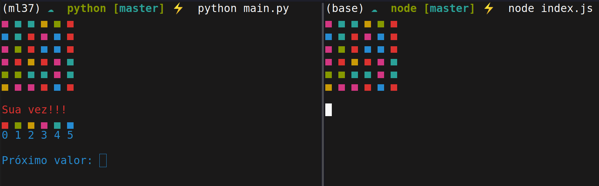

# Drench RPC

----

<p align='center'>
    
</p>

Implementando o jogo drench em xmlrpc. A comunicação ocorre entre **node** e **python**. 

## Arquivos

```txt
node
    |--> core
            |--> drench.js: Implementa a lógica do jogo
    |--> test
            |--> main.js: Implementa um teste do jogo singleplayer

    |--> index.js: Implementa a comunicação
python
    |--> core
            |-->drench.py: Implementa a lógica do jogo
    |--> test
            |-->main.py: Implementa um teste do jogo singleplayer
    |--> main.py : Implementa a comunicação
```

## Dependências

Para instalar as dependências do software em **node**, digite o seguinte:

```sh
cd node
npm install
```

O programa em **python** não possui nenhuma dependência, mas certifique-se de que seu interpretador python está na versão 3.

## Execução

1. Abra dois terminais
2. Execute primeiro o **node**

```sh
cd node
node index.js
```

3. Execute agora o **python**
   
```sh
cd python
python main.py
```

[Veja uma demonstração de execução](https://youtu.be/HhxhSkiwiBs)
